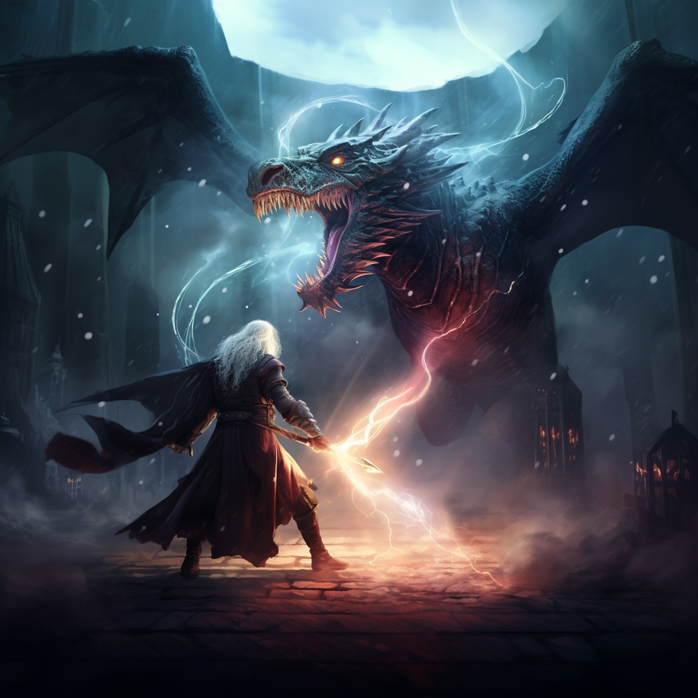

<h2>Hei 👋, mitt navn er Sindre og jeg er en fersk front-end utvikler. </h2>


Jeg har jobbet med og på datamaskiner siden 90-tallet, og jeg synes det er den ideelle plattformen for å utforske og utvikle kreative konsepter. Jeg har jobbet med programvare som RPG Maker, Blender, Valve og Bethesda kartverktøy, AI-verktøy som Midjourney og ChatGPT og mye mer. Jeg elsker å lære nye ting og å forbedre mine egne ferdigheter så jeg kan gi liv til ideer. 

Jeg er lidenskapelig opptatt av ting som ikke er av denne verden, som fantasi🐉, bordrollespill🧙‍♂️ og science fiction👾. Jeg liker også noen ting i denne verden, som livet i havet🦀, historie⚔ og dinosaurer🦖.

Nå jobber jeg med en "old school" dungeon crawler i React med bilder laget med Midjourney.



<hr>

```javascript
const Sindre = [
{ "class": "Apprentice",
  "race": "Human",
  "alignment": "CG",
  "level": 37,
  "background": "Academic",
  "languages": ["Norwegian", "English"],
  "abilities": ["HTML", "Css", "Js", "React"],
  "hobbies": ["RPG", "SCUBA Diving", "Coding", "Learning"]
}]
```

<em><b>Jeg elsker å jobbe med kode og er svært fasinert av AI🤖</b> så hvis du har lyst til å si <b>"Hei", er jeg klar for en god samtale!</b></em>

---
